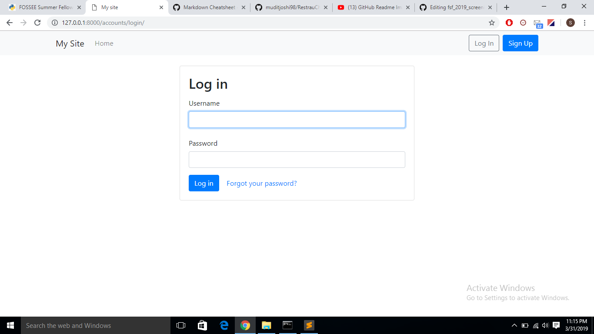
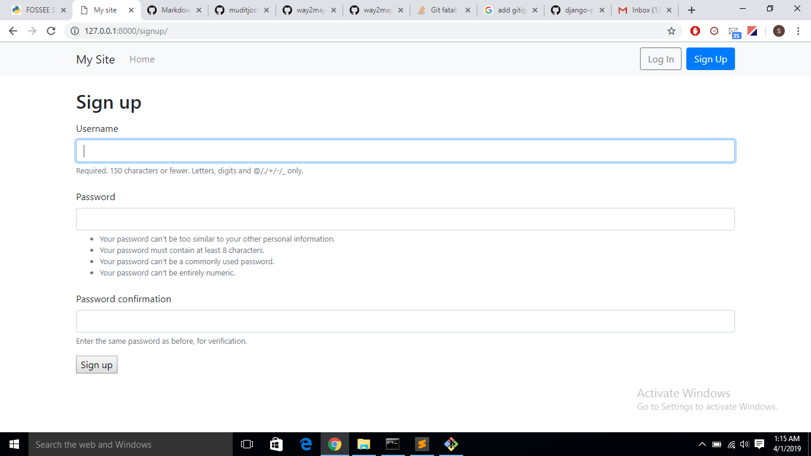
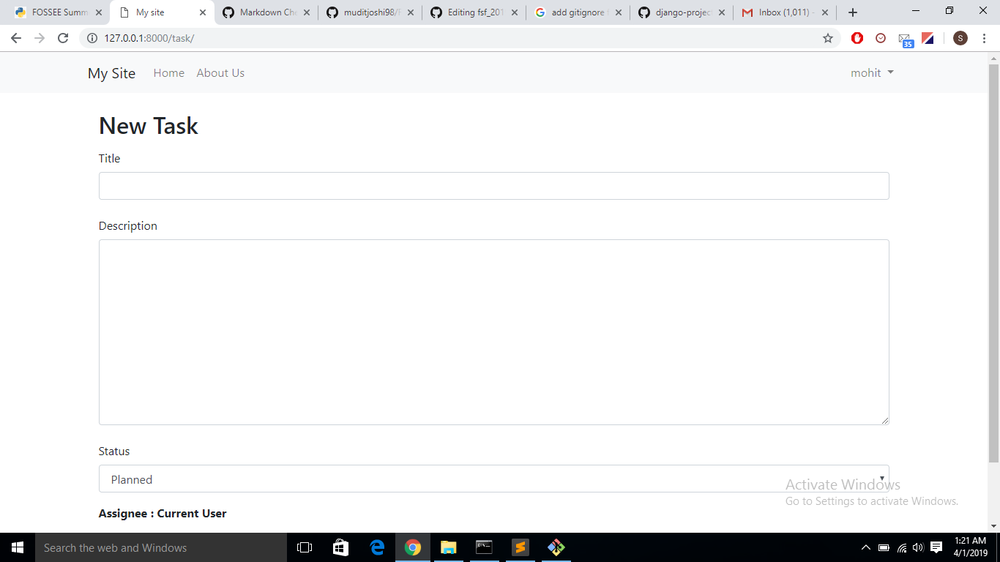
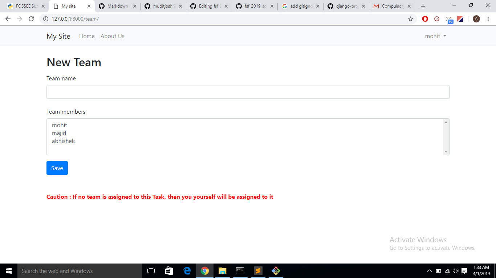

# emApp, world's best Task Manager App

### Everywhere with you 

emApp is webapp written in Python using Django web-framework. It connects people in an organization and facilitates the formation of Teams and assignments of Tasks to those Teams

### How it works

1) Allows a user to Sign-up  
2) Allows authenticated user to log-in/ sign-in

 
3) Allows only an autheticated user to create Tasks  
 

 
4) Only an authenticated user can create Teams and assign members to a Team
 

 
