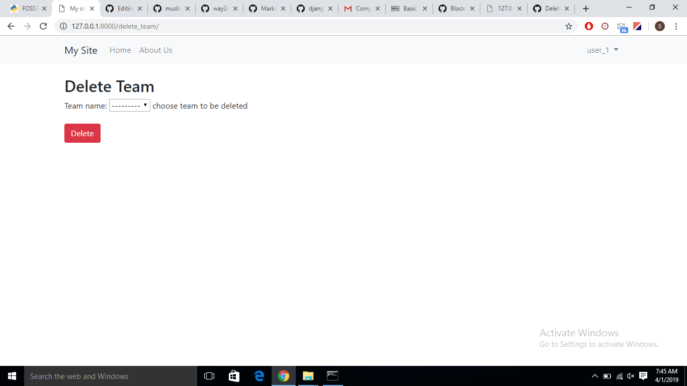
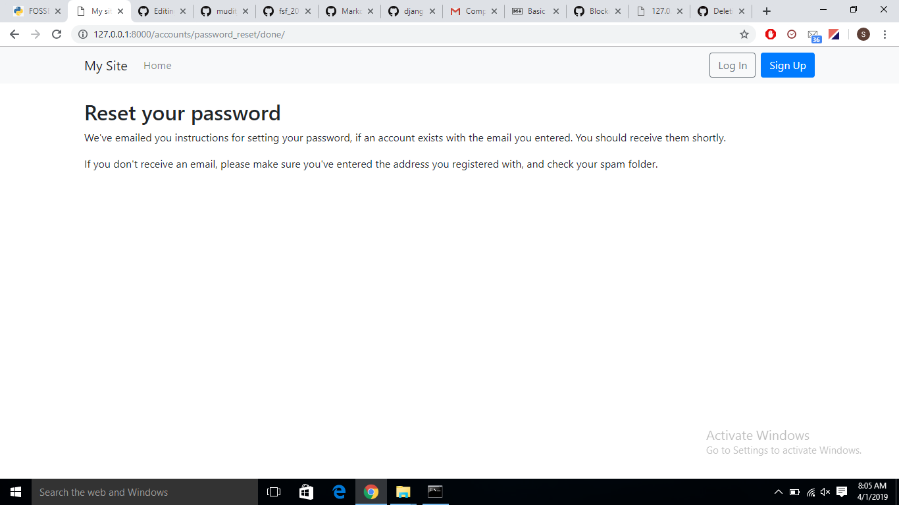

# emApp, world's best Task Manager App

### Stay Connected ...

emApp is webapp written in Python using Django web-framework. It connects people in an organization and facilitates the formation of Teams and assignments of Tasks to those Teams

### Requirements

* Python 3.7  
Other requirements are specified in **requirements.txt** 

### How to get started

* Download and install Python 3.7
* Open the Windows Command Prompt and create a virtual environment by using **mkvirtualenv [name]** command
* Enter into the virtual environment by typing **workon [name]** 
* Install the requirements: pip install -r requirements.txt
* Enter the **mysite** directory
* Make migrations : python manage.py makemigrations
* Migrate changes to the database : python manage.py migrate
* Run the server : python manage.py runserver
* Open http://127.0.0.1:8000/ in your browser, you'll see 

 

### How it works
<ul>
  <li> Allows a user to Sign-up </li>
  <li>Allows authenticated user to Log-in/ Sign-in</li>

<li>Once the user has been authenticated, he/she will be taken to the Homepage. All the options are available on the Homepage</li>

 

<li> An authenticated user can do the following : 
<ul>
  <li> Create Tasks <li>

<li> Task will be registered in the database in the name of the currently logged-in user</li>

<li>Create Teams and assign members from among the authenticated users to that Team

 
<li> Team will be registered in the database in the name of the currently logged-in user</li>

<li> Assign Task to a Team ( Only those Tasks and Teams will be displayed that the currently logged-in user has created)</li> 

<li> See what Tasks and Teams the current user has created and what Tasks he/she has assigned to other users</li>
  
  
  
 <li> Delete the Teams that the user has created. Only those Teams will be displayed in the dropdown menu that the currently logged-in user has created </li>

<li> Similarly we can delete Tasks. Only those Tasks will be displayed in the dropdown menu that the currently logged-in user has created</li>

<li> See those Teams of which the current user is a member, but not creator ( select <em>You are Team Member of</em> ...from the Homepage) </li>
  
  
  
<li> See the Tasks that we have been assigned , by ourselves or by another user ( select <em>You are working on these Tasks</em> ... from the Homepage </li>

  
  
 <ul>
  </li>
  
  <li> If a user forgets his/her password, then to access his account he/she will have to create a new password by selecting <em>Forgot your password</em> </li>
  
  
  
<li> The the user will have to enter his email address <li>
  
  
  
 <li> The following message will be displayed </li>
 
  
  
 <li> Actually no email has been sent. To activate this feature we will have to set up the SMTP server</li>
 

  
 

  
 
 

